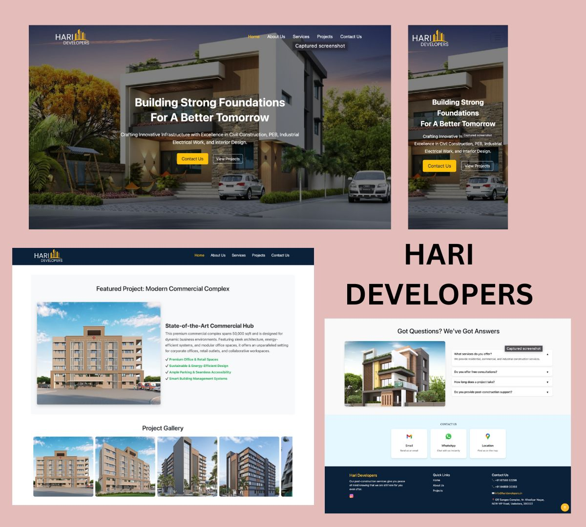

# 🏗️ HariDevelopers – Construction Business Website

**HariDevelopers.in** is a responsive, single-page business website developed for a construction company to showcase its services, portfolio, and contact information. The website was built from scratch as a **freelance project**, with an emphasis on clean design, mobile responsiveness, and user-friendly navigation.

## 📸 Preview

🔗 **Live Project**: [https://haridevelopers.in/](https://haridevelopers.in/)

---

## 🛠️ Tech Stack

- **HTML5**
- **CSS3**
- **JavaScript**
- **Bootstrap 5**
- **Image Optimization & Processing**

---

## 🚀 Features

- 📱 Fully responsive design across devices
- 🛠️ Service showcase section with structured layout
- 🖼️ Image gallery for completed projects
- 📬 Contact form for lead generation
- 🌐 Smooth scrolling and clean navigation
- 🎯 SEO-friendly structure and metadata
- 💬 Real-world collaboration with the client to iterate on design & content

---

---

## 📌 Highlights

- Worked 1-on-1 with the client to gather requirements and implement feedback  
- Completed the project within a tight deadline  
- Focused on **real-world needs**: accessibility, performance, mobile-friendliness  
- Gained experience in **requirement analysis**, **client communication**, and **delivery under pressure**

---

## 🙋‍♀️ Author

<table>
  <tr>
    <td>
      <strong>Ishita Amin</strong> 
      👩‍💻 B.Tech CSE @ Navrachana University 
      📬 <a href="mailto:aminishita30@gmail.com">aminishita30@gmail.com</a> 
      🔗 <a href="[https://linkedin.com/in/ishitaamin](https://www.linkedin.com/in/ishita-amin-841726253)" target="_blank">LinkedIn</a> 
    </td>
  </tr>
</table>

